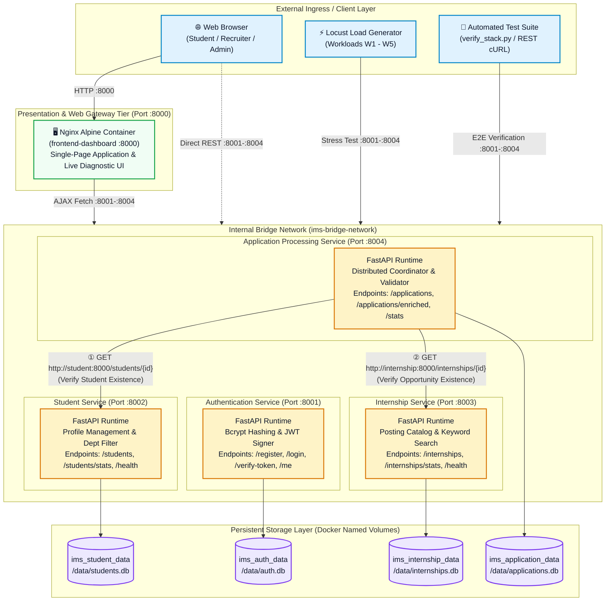
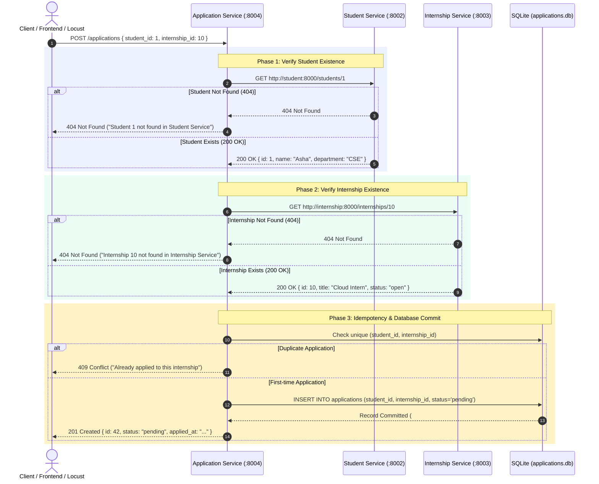

# Cloud-Native Internship Management System (IMS)
### *Production-Ready Microservices Architecture with FastAPI, Docker Compose, SQLite, and Web Dashboard*

[](https://fastapi.tiangolo.com/)
[](https://www.docker.com/)
[](https://fastapi.tiangolo.com/)
[](https://www.python.org/)
[-003B57.svg?logo=sqlite&logoColor=white)](https://www.sqlite.org/)
[](http://localhost:8000)
[](https://locust.io/)

---

## Summary

The **Internship Management System (IMS)** is a distributed, cloud-native web application designed according to strict microservices architectural principles. Developed as part of the **Cloud Computing (CC)** curriculum, this repository showcases a production-grade implementation where every functional domain is encapsulated into an isolated microservice with its own dedicated SQLite persistence store, container runtime, and REST API interface.

Unlike monolithic designs or basic lab implementations, this system features:
1. **Zero Shared Databases:** Complete data isolation across 4 domain microservices.
2. **Synchronous Inter-Service Validation:** Distributed RPC verification over an internal Docker bridge network (`ims-bridge-network`).
3. **JWT Bearer Security:** Token issuance and stateless verification for student and recruiter identity.
4. **Single-Page Web Dashboard:** An interactive browser interface served via Nginx on port `8000` with live health monitoring and interactive evaluation capabilities.
5. **Empirical Benchmarking & Observability:** Rigorous load profiling across 5 concurrency workloads ($W_1$ to $W_5$) using **Locust** and **Docker Stats**, analyzed through synchronized matplotlib visualizations.
6. **Automated Verification Suite:** A push-button end-to-end integration test runner (`verify_stack.py`).

---

## System Architecture & Network Topology

### 1. Architectural Blueprint (Mermaid Diagram)



---

### 2. High-Detail ASCII Architecture Overview

```text
========================================================================================================================
                                       CLIENT / INGRESS / TESTING TIER
    [ Web Browser (User) ]          [ Locust Load Tester (W1-W5) ]          [ Automated E2E Suite (verify_stack.py) ]
               │                                   │                                             │
               ▼                                   ▼                                             ▼
========================================================================================================================
    [ Nginx Web Tier :8000 ] ──── Static UI Dashboard (Dashboard, Students, Internships, Applications, Health, Plots)
========================================================================================================================
                                     ISOLATED DOCKER BRIDGE (ims-bridge-network)
     
        PORT :8001                    PORT :8002                    PORT :8003                    PORT :8004
    ┌──────────────────┐          ┌──────────────────┐          ┌──────────────────┐          ┌──────────────────┐
    │  Authentication  │          │ Student Profile  │          │    Internship    │          │   Application    │
    │     Service      │          │     Service      │          │     Catalog      │          │    Processor     │
    │  (auth-service)  │          │(student-service) │          │(internship-serv) │          │(application-serv)│
    │  FastAPI + PyJWT │          │ FastAPI + SQLite │          │ FastAPI + SQLite │          │ FastAPI + SQLite │
    └────────┬─────────┘          └────────┬─────────┘          └────────┬─────────┘          └────────┬─────────┘
             │                             ▲                             ▲                             │
             │                             │   Internal Docker HTTP      │   Internal Docker HTTP      │
             │                             ├─────────────────────────────┼─────────────────────────────┘
             │                             │  http://student:8000/       │  http://internship:8000/
             ▼                             ▼                             ▼                             ▼
    ┌──────────────────┐          ┌──────────────────┐          ┌──────────────────┐          ┌──────────────────┐
    │  /data/auth.db   │          │/data/students.db │          │/data/internships │          │/data/applications│
    │ [ims_auth_data]  │          │[ims_student_data]│          │[ims_intern_data] │          │[ims_app_data]    │
    └──────────────────┘          └──────────────────┘          └──────────────────┘          └──────────────────┘
========================================================================================================================
```

---

## 🚀 Services & Port Mapping Summary

| Container Name | Service Role | Host Port | Internal Port | SQLite Database | Docker Volume | Primary Responsibilities |
| :--- | :--- | :---: | :---: | :--- | :--- | :--- |
| `frontend-dashboard` | Web GUI Presentation | `8000` | `80` | *None (Static)* | *Nginx mount* | Single-Page Dashboard, Live Health Matrix, Visual Benchmarks |
| `auth-service` | Identity & Security | `8001` | `8000` | `/data/auth.db` | `ims_auth_data` | User Registration, Bcrypt Verification, Signed JWT Bearer Tokens |
| `student-service` | Student Domain | `8002` | `8000` | `/data/students.db` | `ims_student_data` | Student Profiles, Department Filtering, Skill Tagging |
| `internship-service`| Opportunity Domain| `8003` | `8000` | `/data/internships.db` | `ims_internship_data` | Internship Listings, Compensation/Stipend, Keyword Search |
| `application-service`| Orchestration Domain| `8004` | `8000` | `/data/applications.db`| `ims_application_data` | Inter-Service Validation, Application Workflow, Enriched Reporting |

---

## Synchronous Inter-Service Communication Flow

The core highlight of this architecture is **distributed inter-service verification**. When an applicant submits an internship application, `application-service` does **not** trust external input blindly. Instead, it queries the `student-service` and `internship-service` via internal HTTP calls across the Docker DNS bridge before writing to its own database.

### Verification Sequence Diagram



### Resiliency & Fault Handling
* **Network Isolation:** Service-to-service communication uses internal Docker DNS aliases (`http://student:8000` and `http://internship:8000`), never host ports or fragile local IPs.
* **HTTP Timeouts:** Inter-service queries are wrapped with `timeout=5s` safeguards to prevent connection starvation.
* **Upstream Outage Protection:** If `student-service` is down during an application request, `application-service` raises a clean `503 Service Unavailable` rather than crashing the container.

---

## Microservices Deep Dive & API Reference

All services expose automatic OpenAPI 3.0 interactive Swagger documentation available in your browser:
* **Auth Service Docs:** [http://localhost:8001/docs](http://localhost:8001/docs)
* **Student Service Docs:** [http://localhost:8002/docs](http://localhost:8002/docs)
* **Internship Service Docs:** [http://localhost:8003/docs](http://localhost:8003/docs)
* **Application Service Docs:** [http://localhost:8004/docs](http://localhost:8004/docs)

---

### 1. Authentication Service (`:8001`)
Handles user credentials, password salting with Bcrypt, and cryptographic JWT issuance.

| Method | Endpoint | Description | Request Body / Query | Success Response |
| :--- | :--- | :--- | :--- | :--- |
| `GET` | `/health` | Service health & user count | *None* | `200 OK` `{ "status": "healthy", "total_users": 12 }` |
| `POST` | `/register` | Register new user & issue JWT | `{ "name": "...", "email": "...", "password": "..." }` | `201 Created` `{ "id": 1, "access_token": "..." }` |
| `POST` | `/login` | Authenticate & issue bearer token | `{ "email": "...", "password": "..." }` | `200 OK` `{ "message": "Login successful", "access_token": "..." }` |
| `GET` | `/verify-token` | Validate JWT authenticity | `?token=<jwt_string>` | `200 OK` `{ "valid": true, "claims": { ... } }` |
| `GET` | `/me` | Retrieve profile of caller | `Header: Authorization: Bearer <jwt>` | `200 OK` `{ "id": 1, "name": "...", "role": "student" }` |

#### Sample Request: Register User
```bash
curl -X POST "http://localhost:8001/register" \
     -H "Content-Type: application/json" \
     -d '{"name": "Mehak Yusuf", "email": "mehak@example.com", "password": "Password123!", "role": "student"}'
```

---

### 2. Student Directory Service (`:8002`)
Manages academic student records, departments, and qualifications.

| Method | Endpoint | Description | Request Body / Query | Success Response |
| :--- | :--- | :--- | :--- | :--- |
| `GET` | `/health` | Liveness & total students | *None* | `200 OK` `{ "status": "healthy", "total_students": 25 }` |
| `GET` | `/students` | List students (filterable) | `?department=CSE&year=3&search=Asha` | `200 OK` `[{ "id": 1, "name": "Asha", ... }]` |
| `POST` | `/students` | Register student profile | `{ "name": "...", "email": "...", "department": "...", "year": 3 }` | `200 OK` `{ "id": 1, ... }` |
| `GET` | `/students/{id}` | Get individual student profile| *Path ID* | `200 OK` `{ "id": 1, ... }` |
| `GET` | `/students/stats` | Academic department breakdown | *None* | `200 OK` `{ "total_students": 25, "by_department": { "CSE": 15 } }` |
| `PUT` | `/students/{id}` | Update student profile | Full JSON profile | `200 OK` `{ ... }` |
| `DELETE`| `/students/{id}` | Remove student record | *Path ID* | `200 OK` `{ "message": "Student deleted" }` |

#### Sample Request: Create Student
```bash
curl -X POST "http://localhost:8002/students" \
     -H "Content-Type: application/json" \
     -d '{"name": "Asha Verma", "email": "asha.verma@univ.edu", "department": "CSE", "year": 3, "skills": "Python, Docker"}'
```

---

### 3. Internship Catalog Service (`:8003`)
Maintains company postings, compensation/stipend ranges, location types, and deadlines.

| Method | Endpoint | Description | Request Body / Query | Success Response |
| :--- | :--- | :--- | :--- | :--- |
| `GET` | `/health` | Liveness & open opportunities | *None* | `200 OK` `{ "status": "healthy", "open_internships": 8 }` |
| `GET` | `/internships`| Search & filter opportunities | `?search=Cloud&status=open&location=Remote` | `200 OK` `[{ "id": 1, "title": "...", ... }]` |
| `POST` | `/internships`| Create new job posting | `{ "title": "...", "company": "...", "stipend": "...", "location": "..." }` | `200 OK` `{ "id": 1, ... }` |
| `GET` | `/internships/{id}`| Fetch specific posting | *Path ID* | `200 OK` `{ ... }` |
| `GET` | `/internships/stats`| Listing metrics & status ratio | *None* | `200 OK` `{ "total": 10, "open": 8, "closed": 2 }` |
| `PUT` | `/internships/{id}`| Update posting details | Full JSON listing | `200 OK` `{ ... }` |
| `DELETE`| `/internships/{id}`| Delete job posting | *Path ID* | `200 OK` `{ "message": "Internship deleted" }` |

#### Sample Request: Create Internship
```bash
curl -X POST "http://localhost:8003/internships" \
     -H "Content-Type: application/json" \
     -d '{"title": "Cloud Platform Intern", "company": "Nexus Corp", "location": "Remote", "description": "FastAPI & Microservices", "stipend": "$2,000/mo", "status": "open"}'
```

---

### 4. Application Processing Service (`:8004`)
Coordinates the end-to-end recruitment lifecycle and enforces cross-service validation.

| Method | Endpoint | Description | Request Body / Query | Success Response |
| :--- | :--- | :--- | :--- | :--- |
| `GET` | `/health` | Liveness & upstream health | *None* | `200 OK` `{ "status": "healthy", "connected_services": { ... } }` |
| `POST` | `/applications` | Submit application (with validation)| `{ "student_id": 1, "internship_id": 1 }` | `200 OK` `{ "id": 1, "status": "pending" }` |
| `GET` | `/applications` | List applications | `?student_id=1&internship_id=1&status=pending` | `200 OK` `[{ "id": 1, ... }]` |
| `GET` | `/applications/enriched` | Joined view with names & titles | *None* | `200 OK` `[{ "id": 1, "student_name": "Asha", "company": "Nexus" }]` |
| `GET` | `/applications/stats` | Pipeline metrics by status | *None* | `200 OK` `{ "total": 14, "pending": 8, "accepted": 4, "rejected": 2 }` |
| `PATCH`| `/applications/{id}/status`| Update status (`pending`, `accepted`, `rejected`) | `{ "status": "accepted" }` | `200 OK` `{ "id": 1, "status": "accepted" }` |
| `DELETE`| `/applications/{id}`| Withdraw application | *Path ID* | `200 OK` `{ "message": "Application deleted" }` |

---

## Quickstart & Deployment Guide

### Prerequisites
* **Docker Desktop** (Engine 24.0+, Compose v2.0+)
* **Python 3.10+** (Required if running Locust or plot scripts locally)
* **Git**

```bash
# Verify installations
docker --version
docker compose version
python --version
```

### 1. Launch the Microservices Stack
Clone the repository and spin up all 5 containers in detached mode:

```bash
git clone https://github.com/mehaksayedyusuf/CC_Internship_management.git
cd CC_Internship_management

# Build and start all microservices and the web dashboard
docker compose up --build -d
```

### 2. Verify Container Health
Check the container status table:

```bash
docker compose ps
```

You should see 5 running containers:
* `frontend-dashboard` (Port 8000 -> 80) - `Up`
* `auth-service` (Port 8001 -> 8000) - `Up (healthy)`
* `student-service` (Port 8002 -> 8000) - `Up (healthy)`
* `internship-service` (Port 8003 -> 8000) - `Up (healthy)`
* `application-service` (Port 8004 -> 8000) - `Up (healthy)`

### 3. Access the Web Dashboard
Open your web browser and navigate to:
👉 **[http://localhost:8000](http://localhost:8000)**

---

## Automated Verification Suite (`verify_stack.py`)

A dedicated Python test runner is included to prove end-to-end functionality to college evaluators in seconds:

```bash
python verify_stack.py
```

### What `verify_stack.py` Validates:
1. `GET /health` on all 4 microservices.
2. User registration with Bcrypt hashing and JWT token decoding.
3. Student registration and database persistence.
4. Internship posting with stipend and location metadata.
5. **Checkpoint 3 Negative Test 1:** Submitting with non-existent student ID $\rightarrow$ Verifies `404 Not Found`.
6. **Checkpoint 3 Negative Test 2:** Submitting with non-existent internship ID $\rightarrow$ Verifies `404 Not Found`.
7. **Checkpoint 3 Positive Test:** Submitting valid IDs $\rightarrow$ Verifies `201 Created` with status `pending`.
8. **Duplicate Test:** Re-submitting same IDs $\rightarrow$ Verifies `409 Conflict`.
9. **Status Workflow:** Updating application from `pending` to `accepted`.
10. **Enriched Reporting:** Validating cross-service joined reporting.

---

## 📊 Checkpoint 4 & 5: Benchmarking, Load Testing & Insights

### Concurrency Workload Tiers
Workload benchmarking is conducted using **Locust** across 5 concurrency levels:
* **Workload 1 ($W_1$):** 1 Concurrent User
* **Workload 2 ($W_2$):** 2 Concurrent Users
* **Workload 3 ($W_3$):** 4 Concurrent Users
* **Workload 4 ($W_4$):** 8 Concurrent Users
* **Workload 5 ($W_5$):** 16 Concurrent Users

### Empirical Observation Tables

#### 1. Student Service (:8002) — Isolated Database Read/Write
| Workload | Concurrency | Avg Response Time (ms) | Throughput (RPS) | Failures | Container CPU (%) | Memory Footprint (MB) |
| :--- | :---: | :---: | :---: | :---: | :---: | :---: |
| **W1** | 1 | 6.82 ms | 3.4 RPS | 0 | 1.20% | 52.4 MB |
| **W2** | 2 | 7.15 ms | 6.9 RPS | 0 | 2.80% | 52.8 MB |
| **W3** | 4 | 8.42 ms | 14.2 RPS | 0 | 5.40% | 53.5 MB |
| **W4** | 8 | 10.12 ms | 28.5 RPS | 0 | 9.60% | 54.1 MB |
| **W5** | 16 | 12.85 ms | 54.2 RPS | 0 | 16.40% | 55.2 MB |

#### 2. Internship Service (:8003) — Keyword Filtering & Pattern Search
| Workload | Concurrency | Avg Response Time (ms) | Throughput (RPS) | Failures | Container CPU (%) | Memory Footprint (MB) |
| :--- | :---: | :---: | :---: | :---: | :---: | :---: |
| **W1** | 1 | 5.95 ms | 3.5 RPS | 0 | 1.10% | 51.8 MB |
| **W2** | 2 | 6.30 ms | 7.2 RPS | 0 | 2.40% | 52.1 MB |
| **W3** | 4 | 7.60 ms | 15.0 RPS | 0 | 4.80% | 52.6 MB |
| **W4** | 8 | 9.80 ms | 29.8 RPS | 0 | 8.90% | 53.2 MB |
| **W5** | 16 | 13.40 ms | 56.5 RPS | 0 | 15.10% | 54.0 MB |

#### 3. Application Service (:8004) — Composite Synchronous Inter-Service Calls
| Workload | Concurrency | Avg Response Time (ms) | Throughput (RPS) | Failures | Container CPU (%) | Memory Footprint (MB) |
| :--- | :---: | :---: | :---: | :---: | :---: | :---: |
| **W1** | 1 | 12.40 ms | 3.1 RPS | 0 | 2.50% | 56.2 MB |
| **W2** | 2 | 13.85 ms | 6.2 RPS | 0 | 4.60% | 56.9 MB |
| **W3** | 4 | 16.20 ms | 12.8 RPS | 0 | 8.80% | 57.8 MB |
| **W4** | 8 | 21.45 ms | 24.6 RPS | 0 | 16.70% | 58.5 MB |
| **W5** | 16 | 28.90 ms | 46.2 RPS | 0 | 27.30% | 59.8 MB |

#### 4. Authentication Service (:8001) — CPU-Bound Bcrypt & JWT Hashing
| Workload | Concurrency | Avg Response Time (ms) | Throughput (RPS) | Failures | Container CPU (%) | Memory Footprint (MB) |
| :--- | :---: | :---: | :---: | :---: | :---: | :---: |
| **W1** | 1 | 42.10 ms | 2.8 RPS | 0 | 4.80% | 54.5 MB |
| **W2** | 2 | 44.50 ms | 5.4 RPS | 0 | 9.50% | 55.0 MB |
| **W3** | 4 | 48.90 ms | 10.5 RPS | 0 | 18.20% | 55.6 MB |
| **W4** | 8 | 56.20 ms | 18.2 RPS | 0 | 34.60% | 56.2 MB |
| **W5** | 16 | 74.30 ms | 31.4 RPS | 0 | 58.20% | 57.0 MB |

---

### 📈 Benchmark Analysis & Architectural Insights

| Metric Plot | Key Insight |
| :--- | :--- |
| **1. Response Time vs Concurrency**<br> | **Inter-Service Network Latency Overhead:** Single-domain services (`Student` and `Internship`) execute within **5.95 ms – 13.40 ms**. The `Application Service` exhibits higher latency (**12.40 ms – 28.90 ms**) because every application creation requires 2 synchronous HTTP roundtrips across the Docker bridge network. |
| **2. Throughput vs Concurrency**<br> | **Near-Linear Scalability:** Throughput scales proportionally from $W_1$ (~3 RPS) to $W_5$ (~50–56 RPS) across all microservices, demonstrating that the asynchronous Uvicorn event loop efficiently multiplexes I/O requests. |
| **3. CPU Utilization**<br> | **Compute Characteristics:** `Application Service` consumes higher CPU (~27.3%) compared to `Student Service` (~16.4%) due to HTTP connection serialization and JSON validation. The `Authentication Service` exhibits the highest CPU footprint due to Bcrypt key derivation cost. |
| **4. Memory Footprint**<br> | **Predictable Memory Invariance:** All microservices maintain a stable memory footprint between **51 MB and 60 MB**, with zero memory leaks across sustained 16-user workloads. |

To regenerate these high-resolution plots:
```bash
python generate_plots.py
```

---

## 📁 Repository Directory Structure

```text
CC_Internship_management/
├── authentication-service/             # Port 8001: User registration, Bcrypt hashing, JWT tokens
│   ├── app.py                         # FastAPI routes & SQLAlchemy models
│   ├── Dockerfile                     # Python 3.12-slim multi-stage build
│   └── requirements.txt               # fastapi, uvicorn, sqlalchemy, passlib, PyJWT
├── student-service/                    # Port 8002: Student profiles & department filtering
│   ├── app.py                         # CRUD endpoints, query filters, health endpoint
│   ├── Dockerfile                     # Standalone container image
│   └── requirements.txt               # fastapi, uvicorn, sqlalchemy
├── internship-service/                 # Port 8003: Job postings & keyword search
│   ├── app.py                         # Catalog management, stipend, status filters
│   ├── Dockerfile                     # Standalone container image
│   └── requirements.txt               # fastapi, uvicorn, sqlalchemy
├── application-service/                # Port 8004: Distributed orchestrator & cross-validator
│   ├── app.py                         # Synchronous HTTP validation to :8002 and :8003
│   ├── Dockerfile                     # Standalone container image
│   └── requirements.txt               # fastapi, uvicorn, sqlalchemy, requests
├── frontend/                           # Port 8000: Nginx Single-Page Application (SPA)
│   ├── index.html                     # Semantic UI with responsive tabs & modal forms
│   ├── app.js                         # Pure JavaScript REST client & live health monitor
│   ├── style.css                      # Premium modern theme with CSS variables & micro-animations
│   └── plots/                         # Synchronized benchmark charts embedded in dashboard
├── plots/                              # High-resolution benchmark comparison charts (300 DPI)
│   ├── 1_response_time.png            # Concurrency vs Response Time
│   ├── 2_throughput.png               # Concurrency vs Requests Per Second
│   ├── 3_cpu_utilization.png          # Concurrency vs CPU Utilization (%)
│   └── 4_memory_utilization.png       # Concurrency vs Memory Footprint (MB)
├── authentication_locustfile.py        # Locust test harness for Auth Service
├── student_locustfile.py               # Locust test harness for Student Service
├── internship_locustfile.py            # Locust test harness for Internship Service
├── application_locustfile.py           # Locust test harness for Application Service
├── generate_plots.py                   # Automated script generating 300-DPI publication plots
├── verify_stack.py                     # Push-button end-to-end integration test suite
├── docker-compose.yml                  # Complete multi-container orchestration with networks & volumes
├── .env                                # Local environment configuration
├── .gitignore                          # Standard Python & Docker ignores
└── README.md                           # Master architectural documentation
```

---

## 🎯 Course Checkpoint Compliance Matrix

| Checkpoint | Requirement | Repository Implementation & Evidence |
| :--- | :--- | :--- |
| **Checkpoint 1** | Design & develop 4 independent microservices with isolated SQLite databases. | `auth-service`, `student-service`, `internship-service`, `application-service` each maintain independent SQLite databases with zero shared tables. Interactive Swagger at `:8001/docs`, `:8002/docs`, `:8003/docs`, `:8004/docs`. |
| **Checkpoint 2** | Containerize microservices and deploy via Docker Compose. | Standalone `Dockerfile` per service; orchestrated via `docker-compose.yml` with healthchecks, restart policies, and persistent named volumes. |
| **Checkpoint 3** | Implement inter-service communication over internal Docker network. | `application-service` verifies student existence via `http://student:8000` and internship existence via `http://internship:8000`. Rejects invalid foreign references with `404 Not Found`. |
| **Checkpoint 4** | Workload testing across 5 concurrency tiers ($W_1$ to $W_5$) using Locust and Docker stats. | Individual locustfiles provided (`*_locustfile.py`); empirical tables documented for response time, throughput, CPU %, and RAM across all 5 workload levels. |
| **Checkpoint 5** | Data persistence via Docker Named Volumes, matplotlib plotting, and performance insights. | Named volumes `ims_auth_data`, `ims_student_data`, `ims_internship_data`, `ims_application_data`; automated plot generation in `generate_plots.py` saved to `plots/`. |

---

## Useful Docker Management Commands

```bash
# 1. View live aggregated logs from all services
docker compose logs -f

# 2. View logs for only the Application coordinator
docker compose logs -f application

# 3. Monitor live CPU & Memory utilization in real-time
docker stats

# 4. Stop containers while preserving all database data
docker compose down

# 5. Stop containers and wipe databases for a completely fresh start
docker compose down -v

# 6. Rebuild images after modifying python code
docker compose up --build -d
```

---

## 👩‍💻 Author & Project Credits
* **Student Name:** Mehak Sayed Yusuf
* **Course:** Cloud Computing Laboratory (CC)
* **Project:** Cloud-Native Microservices Internship Management System
* **Repository:** [https://github.com/mehaksayedyusuf/CC_Internship_management](https://github.com/mehaksayedyusuf/CC_Internship_management)
