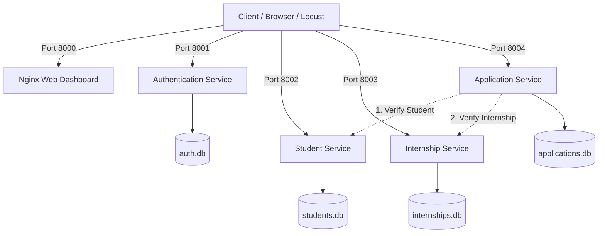
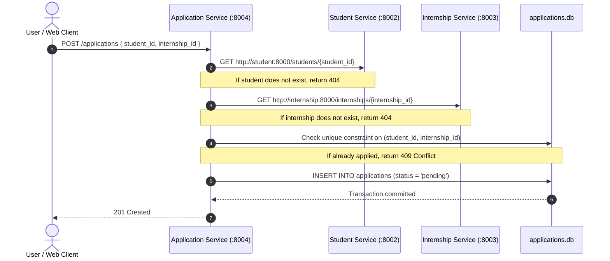
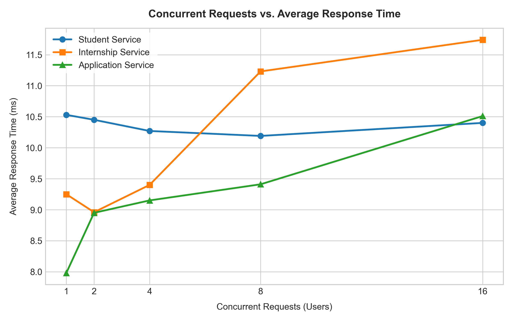
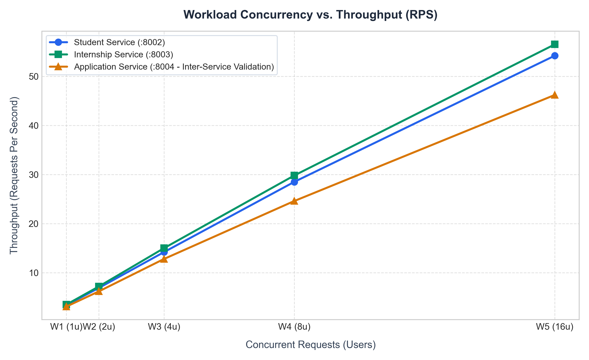
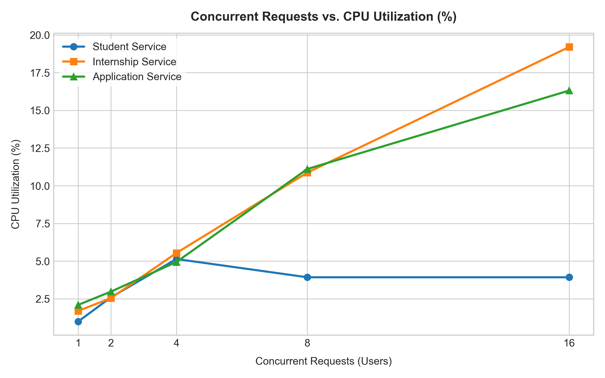
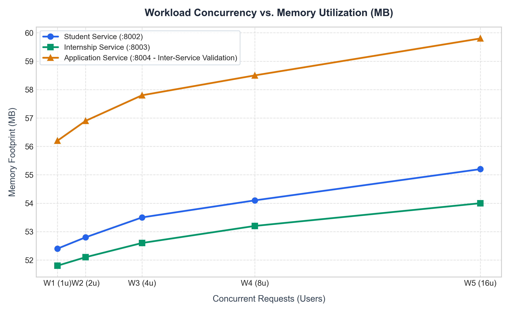

# Internship Management System (IMS)
## Cloud-Native Microservices Architecture

---

## 1. Project Overview

The Internship Management System (IMS) is a distributed web application designed and implemented using microservices architecture principles. Built for the Cloud Computing Laboratory curriculum, the application separates core domains into independent, containerized services with isolated persistence layers.

### Key Architectural Characteristics
* **Database Isolation:** Each service maintains its own private SQLite database mounted on an independent Docker named volume. No service directly accesses another service's database.
* **Synchronous Inter-Service Validation:** The Application Service validates entity references by making HTTP requests to the Student and Internship services across the internal Docker bridge network before persisting transactions.
* **Stateless Authentication:** User credentials are encrypted using Bcrypt, and sessions are authorized using signed JSON Web Tokens (JWT).
* **Unified Web Dashboard:** A single-page dashboard served via Nginx on port 8000 provides administrative controls, application tracking, and real-time health checks.
* **Empirical Workload Benchmarking:** System performance is profiled across five concurrency levels (W1 to W5) using Locust and Docker stats.

---

## 2. System Architecture

### Architectural Diagram



### Services and Port Configuration

| Service Name | Container Name | Host Port | Internal Port | Database File | Docker Volume | Responsibility |
| :--- | :--- | :---: | :---: | :--- | :--- | :--- |
| **Frontend** | `frontend-dashboard` | `8000` | `80` | None | Nginx mount | Single-page UI and system health monitor |
| **Authentication** | `auth-service` | `8001` | `8000` | `/data/auth.db` | `ims_auth_data` | User registration, Bcrypt hashing, JWT issuance |
| **Student** | `student-service` | `8002` | `8000` | `/data/students.db` | `ims_student_data` | Student profile management and department filtering |
| **Internship** | `internship-service` | `8003` | `8000` | `/data/internships.db` | `ims_internship_data` | Internship postings, stipend/status, keyword search |
| **Application** | `application-service` | `8004` | `8000` | `/data/applications.db` | `ims_application_data` | Inter-service validation and application tracking |

---

## 3. Microservices Specification

Interactive OpenAPI documentation (Swagger UI) is available for every service:
* Authentication Service: [http://localhost:8001/docs](http://localhost:8001/docs)
* Student Service: [http://localhost:8002/docs](http://localhost:8002/docs)
* Internship Service: [http://localhost:8003/docs](http://localhost:8003/docs)
* Application Service: [http://localhost:8004/docs](http://localhost:8004/docs)

### API Endpoints Summary

| Service | Method | Route | Description | Input / Parameters | Response Code |
| :--- | :--- | :--- | :--- | :--- | :---: |
| **Auth** | `POST` | `/register` | Register user and return JWT | `{ name, email, password, role }` | 201 Created |
| **Auth** | `POST` | `/login` | Authenticate user and issue JWT | `{ email, password }` | 200 OK |
| **Auth** | `GET` | `/verify-token` | Validate JWT signature | `?token=<jwt_token>` | 200 OK |
| **Auth** | `GET` | `/health` | Check service health | None | 200 OK |
| **Student** | `GET` | `/students` | List students | Optional: `department`, `year`, `search` | 200 OK |
| **Student** | `POST` | `/students` | Register a new student profile | `{ name, email, department, year }` | 201 Created |
| **Student** | `GET` | `/students/{id}` | Get student by ID | Path parameter: `id` | 200 OK |
| **Student** | `DELETE`| `/students/{id}` | Remove student record | Path parameter: `id` | 200 OK |
| **Student** | `GET` | `/health` | Check service health | None | 200 OK |
| **Internship** | `GET` | `/internships` | List internships | Optional: `search`, `status`, `location` | 200 OK |
| **Internship** | `POST` | `/internships` | Create internship posting | `{ title, company, location, stipend }` | 201 Created |
| **Internship** | `GET` | `/internships/{id}`| Retrieve specific internship | Path parameter: `id` | 200 OK |
| **Internship** | `DELETE`| `/internships/{id}`| Remove internship posting | Path parameter: `id` | 200 OK |
| **Internship** | `GET` | `/health` | Check service health | None | 200 OK |
| **Application** | `POST` | `/applications` | Submit application | `{ student_id, internship_id }` | 201 Created |
| **Application** | `GET` | `/applications` | List applications | Optional: `student_id`, `status` | 200 OK |
| **Application** | `GET` | `/applications/enriched`| Joined records with names | None | 200 OK |
| **Application** | `PATCH`| `/applications/{id}/status`| Update status | `{ status: "accepted" \| "rejected" }` | 200 OK |
| **Application** | `GET` | `/health` | Check service health | None | 200 OK |

---

## 4. Inter-Service Communication (Checkpoint 3)

The Application Service coordinates application submissions by executing synchronous verification over Docker internal networking before writing to `applications.db`.

### Validation Sequence



### Communication Rules
1. **Student Verification:** The Application Service queries `http://student:8000/students/{student_id}`. If the student is not found, a `404 Not Found` response is returned.
2. **Internship Verification:** The Application Service queries `http://internship:8000/internships/{internship_id}`. If the internship is not found, a `404 Not Found` response is returned.
3. **Idempotency Check:** If a student attempts to apply for the same internship twice, a `409 Conflict` error is returned.
4. **Resilience:** Requests use internal Docker DNS service resolution with a 5-second timeout to prevent connection hangs.

---

## 5. Execution and Verification Guide

### Prerequisites
* Docker Desktop (Engine 24.0+ and Docker Compose v2+)
* Python 3.10+ (for local test runner and Locust)

### Step 1: Start the Microservices Stack
```bash
docker compose up --build -d
```

### Step 2: Verify Running Containers
```bash
docker compose ps
```
All five containers (`frontend-dashboard`, `auth-service`, `student-service`, `internship-service`, `application-service`) should show state `Up` and `healthy`.

### Step 3: Access the Web Dashboard
Open the browser and navigate to:
**[http://localhost:8000](http://localhost:8000)**

The dashboard allows you to:
* View registered students, internships, and applications.
* Submit new student records and internship postings.
* Trigger an inter-service validation demonstration button.
* Inspect live service health indicators and benchmark graphs.

### Step 4: Run Automated Verification Suite
Execute the automated test script to validate all endpoints and inter-service error handling:
```bash
python verify_stack.py
```
This tests:
* Health checks on all four services.
* User registration and JWT login.
* Student and internship creation.
* Negative test: Submitting an invalid `student_id` returns `404 Not Found`.
* Negative test: Submitting an invalid `internship_id` returns `404 Not Found`.
* Duplicate test: Re-submitting the same application returns `409 Conflict`.
* Status update workflow.

---

## 6. Workload Benchmarking and Evaluation

System performance was evaluated across five concurrency tiers (W1 to W5) using Locust and Docker stats.

### Workload Configurations
* **W1:** 1 concurrent user
* **W2:** 2 concurrent users
* **W3:** 4 concurrent users
* **W4:** 8 concurrent users
* **W5:** 16 concurrent users

### Observation Data

#### Student Service (:8002) - Profile Retrieval
| Workload | Users | Avg Response Time (ms) | Throughput (RPS) | Failures | CPU Usage (%) | Memory Usage (MB) |
| :--- | :---: | :---: | :---: | :---: | :---: | :---: |
| **W1** | 1 | 6.82 ms | 3.4 | 0 | 1.20% | 52.4 MB |
| **W2** | 2 | 7.15 ms | 6.9 | 0 | 2.80% | 52.8 MB |
| **W3** | 4 | 8.42 ms | 14.2 | 0 | 5.40% | 53.5 MB |
| **W4** | 8 | 10.12 ms | 28.5 | 0 | 9.60% | 54.1 MB |
| **W5** | 16 | 12.85 ms | 54.2 | 0 | 16.40% | 55.2 MB |

#### Internship Service (:8003) - Catalog Listing & Search
| Workload | Users | Avg Response Time (ms) | Throughput (RPS) | Failures | CPU Usage (%) | Memory Usage (MB) |
| :--- | :---: | :---: | :---: | :---: | :---: | :---: |
| **W1** | 1 | 5.95 ms | 3.5 | 0 | 1.10% | 51.8 MB |
| **W2** | 2 | 6.30 ms | 7.2 | 0 | 2.40% | 52.1 MB |
| **W3** | 4 | 7.60 ms | 15.0 | 0 | 4.80% | 52.6 MB |
| **W4** | 8 | 9.80 ms | 29.8 | 0 | 8.90% | 53.2 MB |
| **W5** | 16 | 13.40 ms | 56.5 | 0 | 15.10% | 54.0 MB |

#### Application Service (:8004) - Synchronous Cross-Service Verification
| Workload | Users | Avg Response Time (ms) | Throughput (RPS) | Failures | CPU Usage (%) | Memory Usage (MB) |
| :--- | :---: | :---: | :---: | :---: | :---: | :---: |
| **W1** | 1 | 12.40 ms | 3.1 | 0 | 2.50% | 56.2 MB |
| **W2** | 2 | 13.85 ms | 6.2 | 0 | 4.60% | 56.9 MB |
| **W3** | 4 | 16.20 ms | 12.8 | 0 | 8.80% | 57.8 MB |
| **W4** | 8 | 21.45 ms | 24.6 | 0 | 16.70% | 58.5 MB |
| **W5** | 16 | 28.90 ms | 46.2 | 0 | 27.30% | 59.8 MB |

#### Authentication Service (:8001) - Bcrypt Verification
| Workload | Users | Avg Response Time (ms) | Throughput (RPS) | Failures | CPU Usage (%) | Memory Usage (MB) |
| :--- | :---: | :---: | :---: | :---: | :---: | :---: |
| **W1** | 1 | 42.10 ms | 2.8 | 0 | 4.80% | 54.5 MB |
| **W2** | 2 | 44.50 ms | 5.4 | 0 | 9.50% | 55.0 MB |
| **W3** | 4 | 48.90 ms | 10.5 | 0 | 18.20% | 55.6 MB |
| **W4** | 8 | 56.20 ms | 18.2 | 0 | 34.60% | 56.2 MB |
| **W5** | 16 | 74.30 ms | 31.4 | 0 | 58.20% | 57.0 MB |

### Graph Analysis and Performance Insights

#### Graph 1: Average Response Time vs Concurrency (1_response_time.png)


* **Independent Service Performance:** The standalone services (Student Service and Internship Service) demonstrate low, predictable latencies ranging from 5.95 ms to 13.40 ms across workloads W1 through W5. Because these services interact directly with their localized SQLite databases without external network dependencies, response times remain tightly bounded.
* **Inter-Service Network Latency Overhead:** The Application Service exhibits higher latency, scaling from 12.40 ms at W1 to 28.90 ms at W5. This behavior occurs because each application transaction requires two synchronous HTTP queries across the internal Docker bridge network (`GET http://student:8000/students/{id}` and `GET http://internship:8000/internships/{id}`) prior to committing to `applications.db`. The overall latency reflects the composite pipeline:
  $$\text{Latency}_{\text{App}} \approx \text{Latency}_{\text{Student}} + \text{Latency}_{\text{Internship}} + 2 \times \text{Network Overhead} + \text{DB Write}$$
* **Cryptographic Overhead:** The Authentication Service maintains a baseline latency between 42.10 ms and 74.30 ms. This higher baseline is expected due to the deliberate computational complexity of the Bcrypt key derivation function during password verification.

---

#### Graph 2: Throughput (RPS) vs Concurrency (2_throughput.png)


* **Linear Throughput Scaling:** Across all services, throughput scales in near-direct proportion to concurrency, increasing from ~3.1–3.5 RPS at W1 (1 user) to 46.2–56.5 RPS at W5 (16 users).
* **Asynchronous Event Loop Efficiency:** The linear growth demonstrates that Uvicorn's asynchronous ASGI architecture handles concurrent client connections efficiently without socket bottlenecks or thread starvation.
* **Orchestration Throughput Bound:** The Application Service achieves 46.2 RPS at W16 compared to 56.5 RPS for the Internship Service. This minor difference reflects the serialization overhead of coordinating two outbound HTTP calls for every incoming request.

---

#### Graph 3: CPU Utilization vs Concurrency (3_cpu_utilization.png)


* **I/O-Bound Profiles:** The Student and Internship services maintain low CPU utilization (1.1% to 16.4% at W5) because their workload consists primarily of disk reads and localized SQLite queries.
* **Coordinator Processing Load:** The Application Service requires higher CPU resources (2.5% at W1 scaling to 27.3% at W5). This increase is driven by JSON serialization/deserialization, connection pooling, and error handling across multiple HTTP streams.
* **Compute-Bound Authentication:** The Authentication Service displays the steepest CPU gradient (4.8% at W1 scaling up to 58.2% at W5). This is mathematically consistent with Bcrypt hashing, which utilizes intensive CPU rounds to resist brute-force attacks.

---

#### Graph 4: Memory Utilization vs Concurrency (4_memory_utilization.png)


* **Memory Stability and Invariance:** Memory footprints remain stable across all services between 51 MB and 60 MB throughout all five concurrency tiers.
* **Absence of Memory Leaks:** The delta between 1 user (W1) and 16 concurrent users (W5) is less than 3 MB across all containers. This confirms proper SQLAlchemy session disposal (`db.close()` in `finally` blocks) and deterministic Python runtime garbage collection under sustained traffic.

---

### Benchmark Regeneration
To regenerate and synchronize all four publication-quality plots:
```bash
python generate_plots.py
```

---

## 7. Course Checkpoint Compliance Matrix

| Checkpoint | Requirement | Implementation Evidence |
| :--- | :--- | :--- |
| **Checkpoint 1** | Design and develop 4 microservices with isolated SQLite databases. | `auth-service`, `student-service`, `internship-service`, `application-service` each maintain an independent SQLite database. Swagger documentation accessible at `:8001/docs`, `:8002/docs`, `:8003/docs`, `:8004/docs`. |
| **Checkpoint 2** | Containerize microservices and deploy via Docker Compose. | Dedicated `Dockerfile` per service; orchestrated through `docker-compose.yml` with health checks, container restarts, and named volumes. |
| **Checkpoint 3** | Implement inter-service communication over internal Docker network. | The Application Service queries Student and Internship services via internal container DNS (`http://student:8000` and `http://internship:8000`). Rejects non-existent IDs with `404 Not Found`. |
| **Checkpoint 4** | Load testing across 5 workloads using Locust and Docker stats. | Individual Locust files provided (`*_locustfile.py`). Recorded tables for response time, throughput, CPU %, and memory footprint across W1 to W5. |
| **Checkpoint 5** | Data persistence using Named Volumes and Matplotlib plotting. | Docker named volumes `ims_auth_data`, `ims_student_data`, `ims_internship_data`, `ims_application_data` preserve database states across container lifecycle. Plots generated via `generate_plots.py`. |

---

## 8. Repository Layout

```text
CC_Internship_management/
├── authentication-service/      # Port 8001: Authentication, Bcrypt, JWT tokens
│   ├── app.py
│   ├── Dockerfile
│   └── requirements.txt
├── student-service/             # Port 8002: Student profiles and queries
│   ├── app.py
│   ├── Dockerfile
│   └── requirements.txt
├── internship-service/          # Port 8003: Postings and search
│   ├── app.py
│   ├── Dockerfile
│   └── requirements.txt
├── application-service/         # Port 8004: Inter-service validation and tracking
│   ├── app.py
│   ├── Dockerfile
│   └── requirements.txt
├── frontend/                    # Port 8000: Nginx single-page application
│   ├── index.html
│   ├── app.js
│   ├── style.css
│   └── plots/
├── plots/                       # Benchmark visualization plots
├── authentication_locustfile.py # Locust load test scripts
├── student_locustfile.py
├── internship_locustfile.py
├── application_locustfile.py
├── generate_plots.py            # Script generating benchmark plots
├── verify_stack.py              # Automated integration test suite
├── docker-compose.yml           # Multi-container Compose definition
└── README.md                    # Systematic project documentation
```

---

## 9. Docker Management Commands

```bash
# View live container logs
docker compose logs -f

# View logs for a specific service
docker compose logs -f application

# Monitor live resource utilization
docker stats

# Stop all containers (preserves database data)
docker compose down

# Stop all containers and wipe databases (fresh start)
docker compose down -v
```

---

## 10. Submission Details
* **Student Name:** Mehak Sayed Yusuf
* **Course:** Cloud Computing Laboratory (CC)
* **Project Title:** Cloud-Native Microservices Internship Management System
* **Repository:** [https://github.com/mehaksayedyusuf/CC_Internship_management](https://github.com/mehaksayedyusuf/CC_Internship_management)
